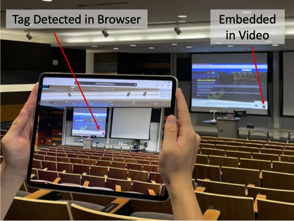

# FLASH

FLASH is a system for delivering AR content to large public spaces like concert stadiums and sporting arenas. It embeds active (blinking) tags into existing video displays, like jumbotrons, allowing smartphones to accurately determine their pose from long distances. Paired with our web-browser-based detection algorithm, FLASH allows delivery of AR content to the masses even in challenging environments with dynamic lighting and staging. We show that our technique outperforms similarly sized passive tags in terms of range by 20-30% and is fast enough to run at 30 FPS within a mobile web browser on a smartphone.



The FLASH detector detects modulated LEDs to anchor AR content as described in this [paper](http://users.ece.cmu.edu/~agr/resources/publications/FLASH_ISMAR_2021.pdf).
This repository is a lightweight implementation of FLASH, able to run in a browser, using WebAssembly.

Click [here](https://www.youtube.com/watch?v=saYG3syOY38) to watch an overview video!


Note: The FLASH browser detector uses **WebGL2.0**, which should be available on all major browsers. For mobile Safari users with iOS <15, please enable WebGL2.0 in Experimental Features.

Based on [apriltag](https://github.com/AprilRobotics/apriltag).

# Building

Note: Make sure you have **opencv** installed if you want to compile the opencv examples.

1. Clone this repo (with ```--recurse-submodules```).
2. Compile with npm:
```
npm run build
```
